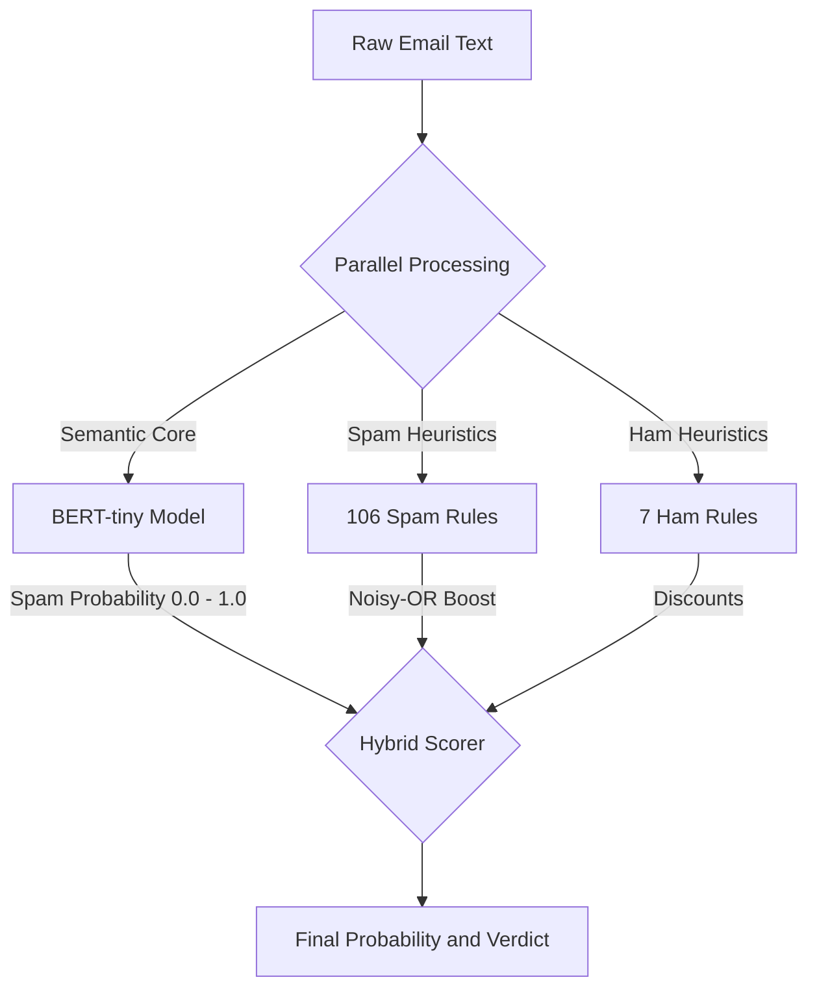

# Hybrid Spam Email Classifier

A zero-shot, hybrid spam classifier that combines a pre-trained BERT-tiny model with a hand-crafted keyword rules engine. It runs locally with no training step and exposes a Streamlit UI plus Python APIs for integration.

## Key capabilities
- BERT-tiny semantic scoring (pre-trained, CPU-friendly)
- 106 spam keyword rules across 10 categories
- 7 ham (safe) rules to reduce false positives
- Batch CSV scoring with auto-detected text column names
- Evaluation on a hand-crafted test set
- Streamlit UI with metrics and charts

## Quickstart (Windows)
```powershell
py -m venv .venv
\.venv\Scripts\Activate.ps1
pip install -r requirements.txt
```

Run the UI:
```powershell
streamlit run streamlit_app.py
```

First run downloads the HuggingFace model to the local cache (CPU only).

## Architecture

### Component layout
```mermaid
flowchart LR
	UI[Streamlit UI] --> Core[backend/core.py]
	Core --> Predict[predict_text / predict_batch]
	Predict --> BERT[bert_model.py (BERT-tiny)]
	Predict --> Rules[keyword_rules.py (spam + ham rules)]
	Predict --> Output[Prediction + confidence + signals + review flag]
```

### System flow


### Scoring logic

Let $p_{bert}$ be the BERT spam probability. If spam rules matched, compute a noisy-OR boost:

$$
b = 1 - \prod_i (1 - w_i)
$$

Blend and clamp against BERT:

$$
p = \max(p_{bert}, 0.6 \cdot b + 0.4 \cdot p_{bert})
$$

If ham rules matched, apply discounts:

$$
p = p \cdot \prod_j (1 - d_j)
$$

Final verdict:
- SPAM if $p \ge 0.5$, else NOT SPAM
- confidence is $p$ for spam, and $1 - p$ for not spam
- `needs_review` is true when confidence is below the review threshold (default 0.60)

### Scoring flowchart
```mermaid
flowchart TD
	P[BERT base probability] --> IsSpamRule{Spam rules matched?}

	IsSpamRule -- Yes --> CalcBoost[Compute boost b]
	CalcBoost --> Blend[Blend score: max(p_bert, 0.6*b + 0.4*p_bert)]

	IsSpamRule -- No --> Blend

	Blend --> IsHamRule{Ham rules matched?}

	IsHamRule -- Yes --> ApplyDiscount[Apply discounts: p * prod(1 - d_j)]
	IsHamRule -- No --> Final[Final probability]

	ApplyDiscount --> Final
	Final --> Check{p >= 0.5?}
	Check -- Yes --> Spam[SPAM]
	Check -- No --> Ham[NOT SPAM]
```

## Repository structure
```
NLP_novalantis/
├── src/spam_detector/
│   ├── bert_model.py         # HuggingFace BERT-tiny wrapper
│   ├── keyword_rules.py      # Spam and ham rules engine
│   ├── predict.py            # Hybrid scoring and batch predictions
│   └── preprocess.py         # clean_text() utility
├── backend/
│   └── core.py               # Public Python API layer
├── streamlit_app.py          # Streamlit UI
├── data/
│   ├── raw/                  # custom_test_set.csv
│   └── processed/            # batch outputs and temporary files
├── scripts/                  # CLI utilities
└── tests/                    # keyword rules, predict, preprocess tests
```

## How to use the Python API
```python
from backend.core import predict_single_email, predict_csv_batch, evaluate

result = predict_single_email("Please verify your account immediately")
batch = predict_csv_batch("data/raw/custom_test_set.csv")
report = evaluate()
```

Returned fields include:
- `prediction`: spam or not spam
- `confidence`: float 0.0 to 1.0
- `needs_review`: True when below review threshold
- `email_signals_detected`: spam rule matches
- `safe_signals_detected`: ham rule matches

## Batch CSV input rules
- Auto-detects text column names: message, text, email, body, content
- Outputs are saved to the CSV passed in `output_csv`

## Evaluation
- `backend.core.evaluate()` runs a full evaluation on the hand-crafted test set
- Metrics include accuracy, precision, recall, F1, specificity, FPR, FNR, MCC, and Cohen's kappa
- The Streamlit UI has a "Performance Dashboard" tab that renders these metrics

## Implementation plan (runbook for new developers)
1. Create a venv, install requirements, and run the Streamlit UI.
2. Use the "Live Inspector" tab to validate a few sample emails.
3. Use "Batch Scanner" to run a CSV and review output in data/processed.
4. Use "Performance Dashboard" to generate evaluation metrics.
5. Run tests with `pytest` and fix any rule changes or regressions.
6. When extending rules, update `keyword_rules.py`, then update or add tests.

## Known limitations
- No training or fine-tuning is performed; BERT-tiny is used as-is and may miss domain-specific patterns.
- Keyword rules are hand-crafted and can be brittle to new or obfuscated spam.
- Only message text is analyzed (no headers, sender reputation, links, or attachments).
- The evaluation dataset is small and hand-crafted, so metrics may not generalize.
- First run requires an internet download for the HuggingFace model cache.

## Future scope and major improvements
- Add a FastAPI service for production-grade HTTP inference.
- Fine-tune or distill the model on a larger email dataset.
- Add URL and header analysis, sender reputation, and attachment heuristics.
- Add multilingual support and language detection.
- Improve evaluation with larger datasets and cross-validation.

## Tests
```powershell
pytest
```

