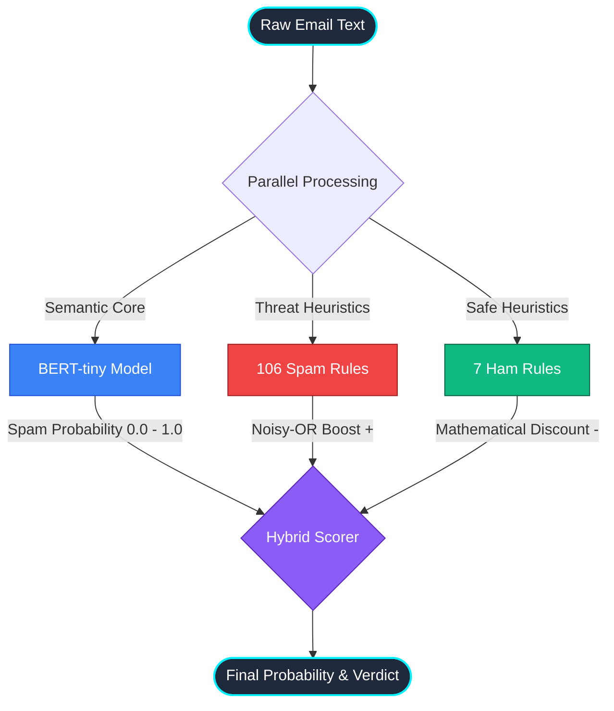
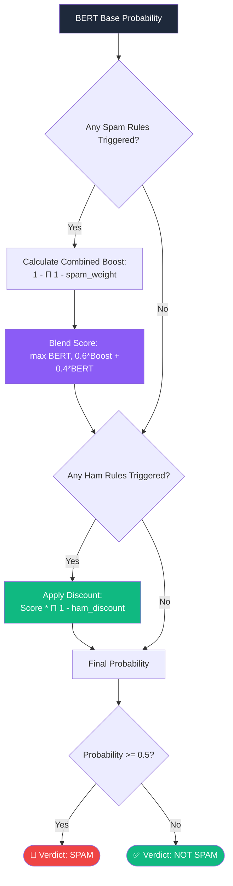

# NLP-Novalantis — Codebase Overview
*Last updated: 2026-05-05 | Branch: `feature/custom-dataset`*

---

## Project Summary

A hybrid email spam classifier combining **BERT-tiny** (HuggingFace pre-trained deep learning) with a **106-rule keyword engine** across 10 spam categories. No Kaggle dataset is used. The system requires no training — BERT is pre-trained and the keyword rules are hand-crafted.

---

## Architecture & Data Flow

The system uses a **Zero-Shot Hybrid Architecture**. It does not require training a local machine learning model, nor does it rely on external datasets like Kaggle. Instead, it pipes incoming data through a pre-trained deep learning semantic core, and then refines the output using hand-crafted heuristics.

### 1. High-Level System Flow


### 2. Scoring Logic (Mathematics)
The hybrid scorer ensures that highly confident BERT predictions are respected, while edge-cases (like short transactional emails) are corrected by the heuristic engines.



---

## Repository Structure

```
NLP_novalantis/
├── src/spam_detector/
│   ├── __init__.py           # Package exports
│   ├── bert_model.py         # HuggingFace pipeline wrapper (lazy-loaded singleton)
│   ├── keyword_rules.py      # 106 keyword rules across 10 categories
│   ├── predict.py            # Hybrid scorer: BERT + keyword boost
│   └── preprocess.py         # clean_text() utility only
│
├── backend/
│   ├── __init__.py
│   └── core.py               # Public API: predict, evaluate (13 metrics), get_rules_info
│
├── data/
│   ├── raw/
│   │   └── custom_test_set.csv   # 50 hand-crafted emails (25 spam, 25 ham) — NO Kaggle
│   └── processed/
│       └── .gitkeep
│
├── tests/
│   ├── test_keyword_rules.py  # 10 tests — rule count, matching, boost math
│   ├── test_predict.py        # 9 tests  — BERT+keyword pipeline end-to-end
│   └── test_preprocess.py     # 6 tests  — clean_text utility
│
├── scripts/
│   └── predict.py             # CLI prediction script
│
├── streamlit_app.py           # Streamlit UI (3 tabs)
├── requirements.txt           # pandas, streamlit, transformers, torch, pytest
├── pyproject.toml
└── .gitignore                 # data/raw/*.csv excluded (no dataset in git)
```

---

## Key Files

### `src/spam_detector/bert_model.py`
- Wraps `mrm8488/bert-tiny-finetuned-sms-spam-detection` from HuggingFace
- Model: 17MB, CPU-friendly, cached in `~/.cache/huggingface/` after first download
- Lazy-loaded singleton — loads once on first call
- `bert_predict_text(text) → {"label": str, "spam_probability": float}`

### `src/spam_detector/keyword_rules.py`
- **106 SpamRule objects** compiled at import time
- Categories and rule counts:

| Category | Rules | Example signals |
|---|---|---|
| marketing | 23 | unsubscribe, newsletter, opt-out, flash sale, promo code |
| phishing | 19 | verify account, account suspended, password expired, OTP |
| scam | 15 | lottery winner, claim prize, advance fee, western union |
| urgency | 9 | act now, limited time, final notice, hours left |
| financial | 11 | make money fast, guaranteed returns, double your money |
| health | 8 | weight loss pill, no prescription needed, miracle cure |
| tech | 7 | your computer has a virus, call Microsoft support |
| gambling | 4 | online casino, free spins, sports betting |
| crypto | 5 | bitcoin investment, token sale, crypto doubler |
| adult | 4 | adult dating, explicit invite, cam site |

- `match_spam_rules(text) → list[SpamRule]` — runs on raw text
- `combined_keyword_boost(rules) → float` — noisy-OR: `1 - Π(1 - wᵢ)`, capped at 0.9999

### `src/spam_detector/predict.py`
- `predict_text(text, review_threshold=0.6) → dict` — single email hybrid prediction
- `predict_batch(input_csv, output_csv, ...) → dict` — batch CSV prediction
- Hybrid scoring: `final = max(bert_prob, 0.6*keyword_boost + 0.4*bert_prob)`
- Always runs keyword rules on **raw text** (before cleaning strips signal words)
- Returns: `prediction`, `confidence`, `needs_review`, `bert_spam_probability`, `email_signals_detected`

### `backend/core.py`
- `predict_single_email(text, threshold)` — wraps predict_text
- `predict_csv_batch(input_csv, output_csv, ...)` — wraps predict_batch
- `evaluate(test_data_path, ...)` — **13 evaluation metrics**:
  - Core: accuracy, precision, recall, F1
  - Extended: specificity, FPR, FNR, MCC (Matthews Correlation Coefficient), Cohen's Kappa
  - Stats: avg_confidence, avg_bert_prob, pct_with_signals, category_hits per keyword category
- `get_rules_info()` — returns all 106 rules grouped by category for UI display

### `data/raw/custom_test_set.csv`
- **50 hand-crafted emails** written from scratch (no Kaggle, no external datasets)
- 25 spam: marketing newsletters, phishing, lottery scams, financial fraud, urgency
- 25 ham: work emails, personal messages, academic reminders
- Used exclusively for evaluation — not for training

---

## Git Branches

| Branch | Purpose |
|---|---|
| `main` | Original codebase with sklearn TF-IDF pipeline |
| `feature/custom-dataset` | **Current active branch** — BERT + keyword rules, no Kaggle |

### Latest commit on `feature/custom-dataset`
```
c28c9fd — feat: BERT + 106 keyword rules hybrid system, remove all sklearn/kaggle code
- 28 files changed, 823 insertions(+), 5901 deletions(-)
- 25/25 tests passing
```

---

## Test Suite (25 tests, all passing)

| File | Tests | What it covers |
|---|---|---|
| `test_keyword_rules.py` | 10 | Rule count ≥50, category presence, specific rule matches, boost math |
| `test_predict.py` | 9 | Output schema, label validity, newsletter/phishing/legit classification, threshold |
| `test_preprocess.py` | 6 | HTML stripping, URL removal, lowercasing, whitespace collapse |

Run: `python -m pytest tests/ -v`

---

## How to Run

```bash
# Activate venv
.venv\Scripts\activate

# Launch the Streamlit app
streamlit run streamlit_app.py

# Run tests
python -m pytest tests/ -v

# Quick CLI prediction
python scripts/predict.py "Click here to claim your free prize now!"
```

---

## What Was Removed (vs `main` branch)

| Removed | Reason |
|---|---|
| `spam.csv` (Kaggle) | Forbidden — not our dataset |
| `model.py`, `train.py`, `threshold.py` | sklearn pipeline no longer needed |
| `evaluate.py`, `io_utils.py` | sklearn helpers, no longer needed |
| `backend/main.py`, `schemas.py`, `service.py`, `config.py` | FastAPI REST layer — overkill for local use |
| `scripts/train.py`, `scripts/evaluate.py`, `scripts/tune_threshold.py` | No training in new system |
| `Demo Proj/`, `agent chat.txt`, `codebase_overview.md` (root) | Junk / dev artifacts |

---

## Dependencies

```
pandas       — DataFrame handling for batch CSV
streamlit    — Web UI
transformers — HuggingFace BERT-tiny model
torch        — PyTorch CPU backend for BERT
pytest       — Test runner
```
